# 🎓 UoH GPA Calculator

<p align="center">
  
</p>

<h3 align="center">GPA, CGPA and Academic Planning Utility for University of Haripur Students</h3>

<p align="center">
  <a href="https://uoh-gpa-calculator-dt4u.onrender.com/"><strong>Live Application</strong></a>
  ·
  <a href="#features">Features</a>
  ·
  <a href="#grading-scale">Grading Scale</a>
  ·
  <a href="#local-setup">Local Setup</a>
  ·
  <a href="#deployment">Deployment</a>
</p>

<p align="center">
  
  
  
  
</p>

---

## Overview

**UoH GPA Calculator** is a responsive academic utility developed for students of the **University of Haripur**.

It brings GPA calculation, CGPA calculation, grading reference, academic planning, result history, and optional student profiles into one interface. The application can be used immediately in **Guest Mode**, while students who want saved history and profile information can create an account.

The interface is designed to remain clear and practical on desktop, laptop, tablet, and mobile screens.

> This is an independent student project and is not presented as an official University of Haripur portal.

---

## Features

### GPA Calculator

Calculate semester GPA by entering:

- Subject name
- Marks obtained
- Credit hours

For every subject, the application determines:

- Grade letter
- Grade points
- Quality points
- Total credit hours
- Final semester GPA

The result updates from the information entered by the student and provides a subject-level breakdown.

---

### CGPA Calculator

Calculate cumulative CGPA using semester-wise information:

- Semester name
- Semester GPA
- Semester credit hours

The calculation uses credit-hour weighting so semesters with different credit loads are handled correctly.

---

### Grading Scale

The application includes a dedicated grading reference showing:

- Marks range
- Grade letter
- Grade points
- Academic performance description

The grading section is responsive and arranged for quick reference on both mobile and desktop screens.

---

### Marks-to-Grade Converter

A marks converter is included for quick grade checking.

Enter marks from `0–100` to view the corresponding:

- Letter grade
- Grade points

This is useful when a complete GPA calculation is not required.

---

### What-If Planner

The **What-If** tool helps students estimate the performance required in upcoming coursework.

Students can enter:

- Current CGPA
- Completed credit hours
- Upcoming credit hours
- Target CGPA

The calculator then estimates the GPA required to move toward the selected academic target.

---

### Target Finder

The **Target Finder** helps students plan a desired semester GPA.

Students select a target and enter the credit hours for upcoming subjects. The tool estimates the level of marks required across those subjects to reach the selected GPA target.

---

### Optional Student Accounts

An account is **not required** to use the main calculator.

Students may create an account when they want access to personal features such as:

- Saved result history
- Student profile
- Profile photo
- Academic information

Guest Mode remains available for students who only want to perform calculations.

---

### Student Profile

Signed-in users can maintain a personal profile containing:

- Full name
- Email address
- Profile photo
- Student ID
- Program / degree
- Current semester
- Target CGPA
- Short academic note

The sign-in email remains read-only inside the profile to avoid accidental account changes.

Profile images are resized before being saved so the interface remains lightweight.

---

### Account History

Signed-in users can review previous GPA and CGPA results from the **History** section.

Saved entries include information such as:

- GPA or CGPA value
- Grade
- Credit hours
- Quality points
- Number of subjects or semesters
- Date and time of calculation

History entries can also be removed or cleared by the user.

---

### Responsive Interface

The application is designed for:

- Desktop computers
- Laptops
- Tablets
- Android phones
- iPhones
- Smaller mobile screens

The mobile interface uses compact controls and app-style navigation so the main tools remain easy to access without horizontal page overflow.

---

## Calculation Method

### GPA

The semester GPA is calculated using weighted quality points:

```text
Quality Points = Grade Points × Credit Hours
```

```text
GPA = Total Quality Points / Total Credit Hours
```

Example:

```text
Grade Points = 4.00
Credit Hours = 3

Quality Points = 4.00 × 3
               = 12.00
```

All subjects are combined using the same credit-hour weighting before the final GPA is calculated.

---

### CGPA

CGPA is calculated using semester GPA and semester credit hours:

```text
Semester Quality Points = Semester GPA × Semester Credit Hours
```

```text
CGPA = Total Semester Quality Points / Total Semester Credit Hours
```

This method prevents a semester with fewer credit hours from receiving the same weight as a semester with a larger academic load.

---

## Grading Scale

The calculator is currently configured with the following grading ranges:

| Marks Range | Grade | Base Grade Points | Description |
|:-----------:|:-----:|:-----------------:|-------------|
| 85–100 | A | 4.00 | Outstanding |
| 80–84 | A- | 3.50 | Excellent |
| 75–79 | B+ | 3.00 | Very Good |
| 70–74 | B | 2.50 | Good |
| 65–69 | B- | 2.00 | Satisfactory |
| 60–64 | C+ | 1.50 | Adequate |
| 55–59 | C | 1.00 | Pass |
| 50–54 | D | 0.50 | Minimum Pass |
| 0–49 | F | 0.00 | Fail |

> Academic grading policies can change. Students should confirm the grading policy applicable to their department, course, and academic session when using the calculator for official planning.

---

## Technology

| Area | Technology |
|------|------------|
| Backend | Python |
| Web Framework | Flask |
| Frontend | HTML, CSS, JavaScript |
| Local Database | SQLite |
| Password Security | Werkzeug password hashing |
| Production Server | Gunicorn |
| Deployment | Render |
| Responsive Design | Custom CSS |

No frontend framework is required for the main interface.

---

## Project Structure

The main project can be organized as follows:

```text
UoH-GPA-Calculator/
│
├── app.py
├── main.py
├── index.html
├── requirements.txt
├── README.md
├── .gitignore
│
└── static/
    ├── css/
    │   └── app.css
    │
    ├── js/
    │   └── app.js
    │
    └── uoh-logo.jpg
```

The application uses Flask for the backend and serves the responsive frontend from the same project.

---

## Local Setup

### Requirements

Before starting, make sure the following are installed:

- Python 3.11 or newer
- pip
- Git

---

### 1. Clone the Repository

```bash
git clone https://github.com/YOUR_USERNAME/uoh-gpa-calculator.git
```

Move into the project directory:

```bash
cd uoh-gpa-calculator
```

Replace `YOUR_USERNAME` with the GitHub username that owns the repository.

---

### 2. Create a Virtual Environment

#### Windows PowerShell

```powershell
py -m venv .venv
```

Activate it:

```powershell
.\.venv\Scripts\Activate.ps1
```

If PowerShell blocks script execution for the current session:

```powershell
Set-ExecutionPolicy -Scope Process -ExecutionPolicy Bypass
```

Then activate the environment again:

```powershell
.\.venv\Scripts\Activate.ps1
```

#### macOS / Linux

```bash
python3 -m venv .venv
```

```bash
source .venv/bin/activate
```

---

### 3. Install Dependencies

```bash
python -m pip install --upgrade pip
```

```bash
pip install -r requirements.txt
```

---

### 4. Run the Application

```bash
python app.py
```

Open:

```text
http://127.0.0.1:5000
```

Health check:

```text
http://127.0.0.1:5000/health
```

Stop the development server with:

```text
Ctrl + C
```

---

## Environment Variables

### `APP_SECRET`

Flask uses a secret key for signed session cookies.

For production, generate a secure value:

```bash
python -c "import secrets; print(secrets.token_urlsafe(48))"
```

Store the generated value as:

```text
APP_SECRET
```

Do not commit the actual secret to GitHub.

---

### `COOKIE_SECURE`

For HTTPS production deployment:

```text
COOKIE_SECURE=1
```

For ordinary local development over `http://127.0.0.1`:

```text
COOKIE_SECURE=0
```

---

## API Routes

The Flask application provides the following routes:

| Method | Route | Purpose |
|--------|-------|---------|
| GET | `/` | Main application |
| GET | `/health` | Application health check |
| GET | `/api/auth/me` | Current authentication state |
| POST | `/api/auth/register` | Create an account |
| POST | `/api/auth/login` | Sign in |
| POST | `/api/auth/logout` | Sign out |
| GET | `/api/profile` | Load signed-in profile |
| PUT | `/api/profile` | Update profile |
| GET | `/api/history` | Load account calculation history |
| POST | `/api/history` | Save a calculation result |
| DELETE | `/api/history/<id>` | Remove one saved result |
| DELETE | `/api/history` | Clear saved history |
| POST | `/api/calculate-gpa` | Calculate semester GPA |
| POST | `/api/calculate-cgpa` | Calculate cumulative CGPA |

---

## Example GPA Request

```http
POST /api/calculate-gpa
Content-Type: application/json
```

```json
{
  "subjects": [
    {
      "name": "Artificial Intelligence",
      "marks": 88,
      "credit_hours": 3
    },
    {
      "name": "Database Systems",
      "marks": 76,
      "credit_hours": 3
    }
  ]
}
```

The response contains the calculated GPA together with subject grades, grade points, credit hours, and quality points.

---

## Example CGPA Request

```http
POST /api/calculate-cgpa
Content-Type: application/json
```

```json
{
  "semesters": [
    {
      "name": "Semester 1",
      "gpa": 3.20,
      "credit_hours": 18
    },
    {
      "name": "Semester 2",
      "gpa": 3.60,
      "credit_hours": 18
    }
  ]
}
```

The response contains the weighted CGPA and semester-level calculation details.

---

## Data and Privacy

The calculator can be used without an account.

For signed-in users:

- Passwords are stored as password hashes rather than plain-text passwords.
- Account history is associated with the signed-in user.
- Profile information is stored by the application backend.
- Profile photos are processed and reduced in size before being saved.
- Session authentication uses an HttpOnly cookie.

Sensitive runtime files should never be committed to the repository.

The `.gitignore` should exclude at least:

```gitignore
.venv/
venv/
__pycache__/
*.pyc

instance/
*.db
*.sqlite
*.sqlite3

.env
.env.*

.DS_Store
Thumbs.db
```

---

## Deployment

The project can be deployed as a Python **Web Service** on Render.

### Render Configuration

| Setting | Value |
|---------|-------|
| Service Type | Web Service |
| Runtime | Python |
| Branch | `main` |
| Build Command | `pip install -r requirements.txt` |
| Start Command | `gunicorn app:app --bind 0.0.0.0:$PORT --workers 1 --threads 4 --timeout 60` |
| Health Check Path | `/health` |

Recommended production environment variables:

```text
APP_SECRET=<secure-random-value>
COOKIE_SECURE=1
```

---

### Important Note About SQLite on Render

The application uses SQLite for its current local backend storage.

If account, profile, and history data must remain available across Render restarts or redeployments, the database needs persistent storage.

For a Render service using a persistent disk, the application `instance` directory can be mounted at:

```text
/opt/render/project/src/instance
```

Without persistent storage, SQLite data should not be treated as permanent on an ephemeral hosting filesystem.

For larger production use, migrating account data to a managed database such as PostgreSQL would be a better long-term option.

---

## GitHub Workflow

Initialize Git if required:

```bash
git init
```

Add files:

```bash
git add .
```

Commit:

```bash
git commit -m "Initial release: UoH GPA Calculator"
```

Set the main branch:

```bash
git branch -M main
```

Connect the repository:

```bash
git remote add origin https://github.com/YOUR_USERNAME/uoh-gpa-calculator.git
```

Push:

```bash
git push -u origin main
```

For later updates:

```bash
git add .
git commit -m "Update GPA Calculator"
git push origin main
```

A connected Render service can automatically redeploy when new commits are pushed to the deployment branch.

---

## Screenshots

The screenshots below show the current desktop and mobile interface of the application.

### Desktop — GPA Calculator

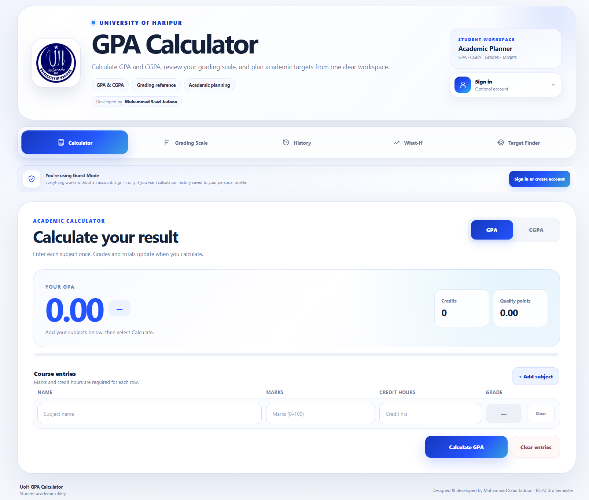

---

### Desktop — Grading Scale

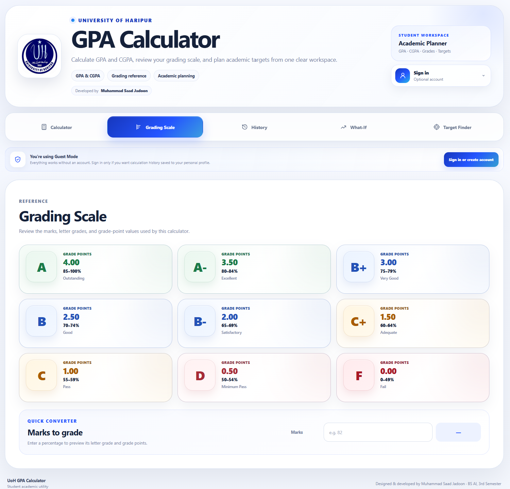

---

### Desktop — What-If Planner

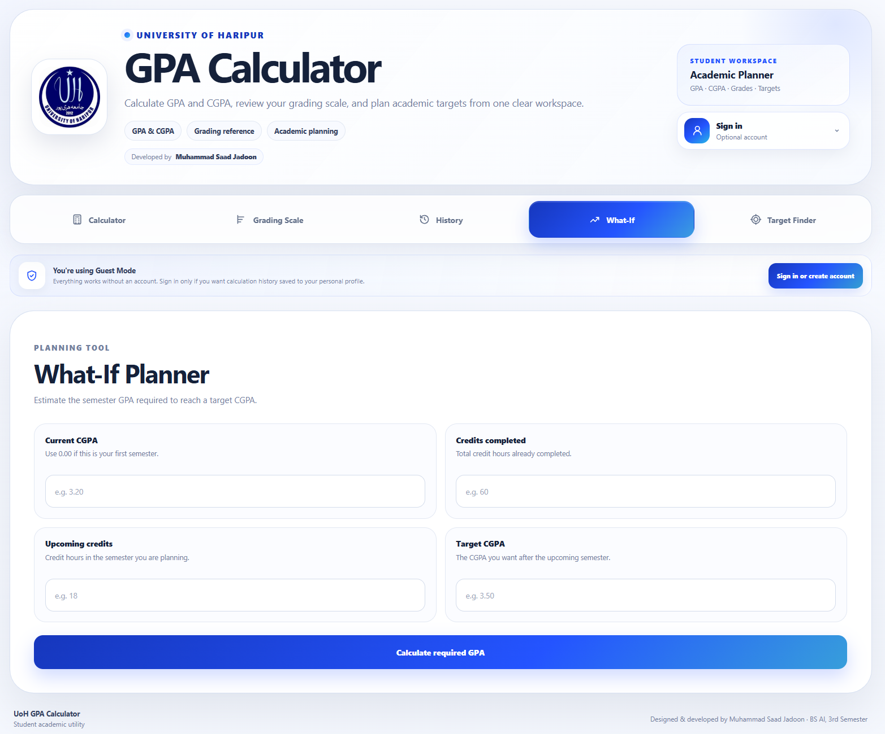

---

### Desktop — Target Finder

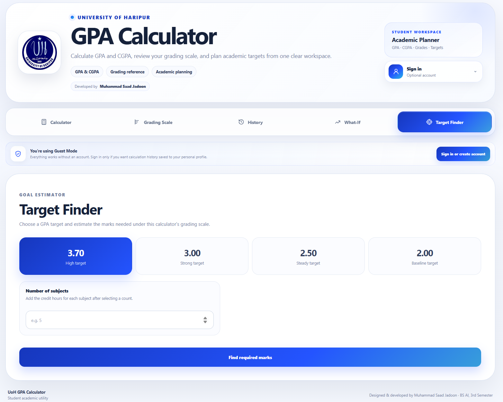

---

### Desktop — Sign In

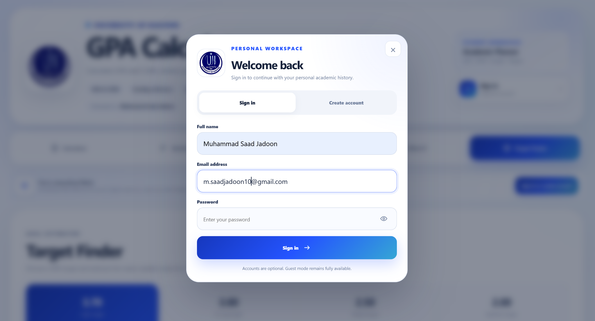

---

### Desktop — Create Account

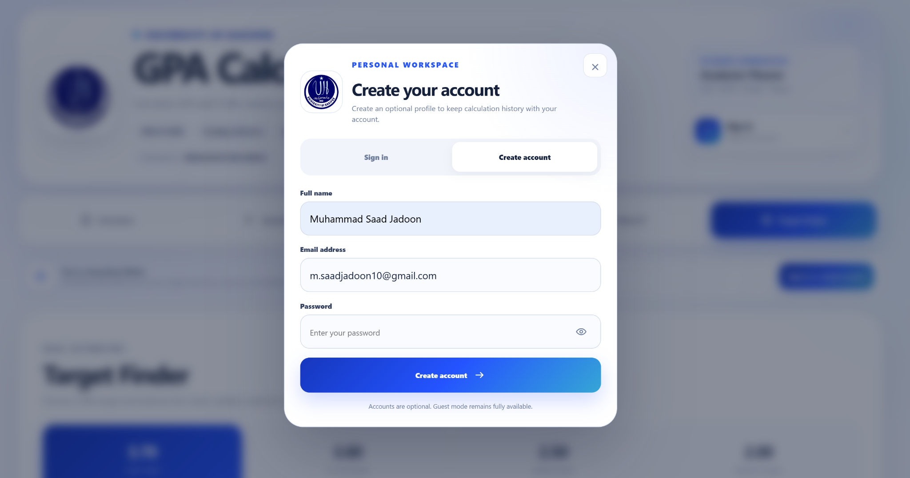

---

### Desktop — CGPA Calculator

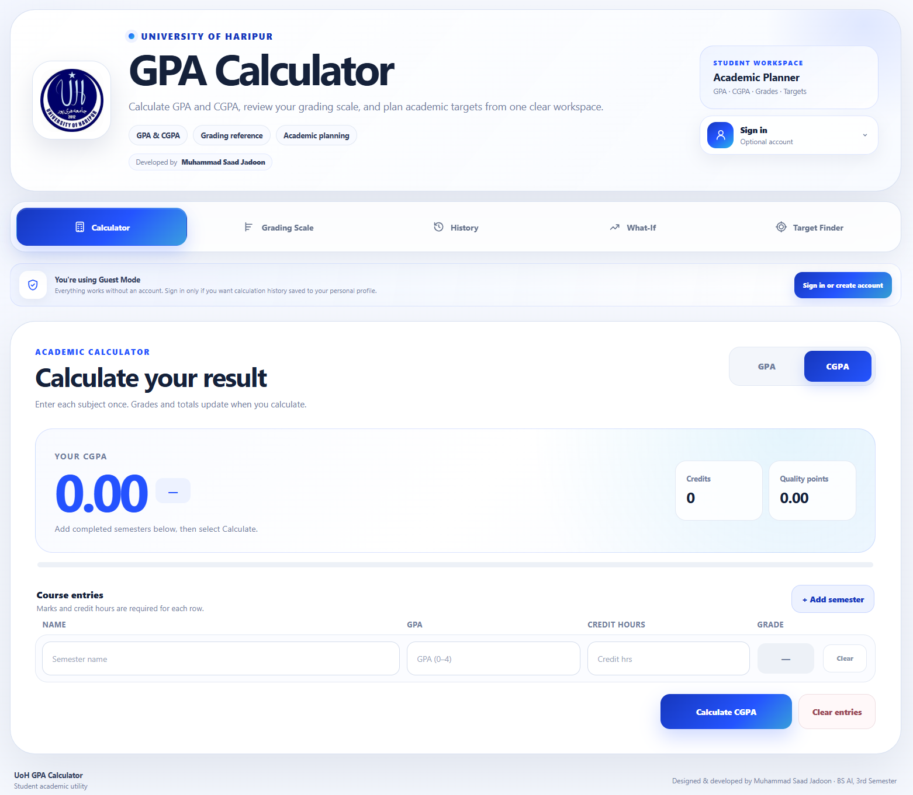

---

### Mobile Interface

<p align="center">
  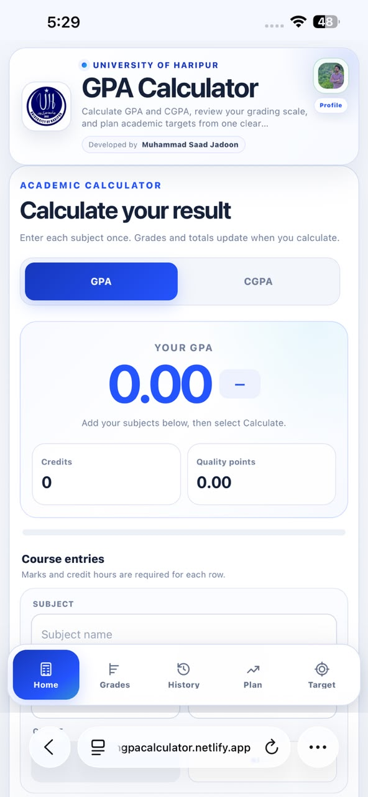
  &nbsp;&nbsp;
  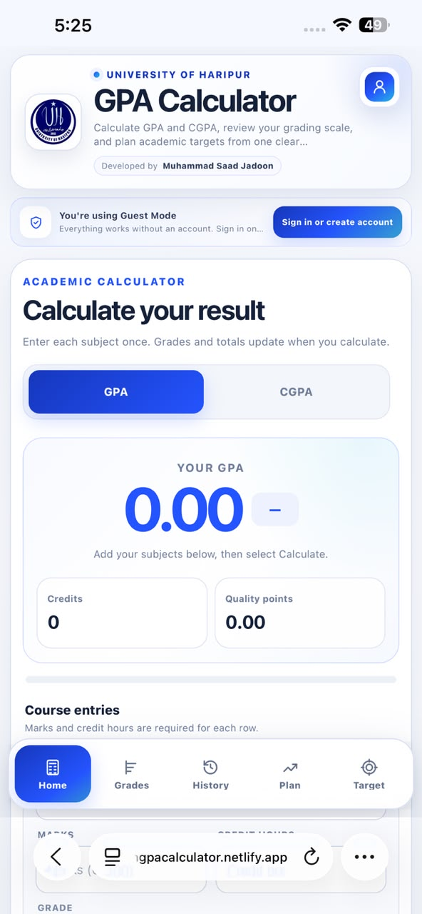
</p>

<p align="center">
  <strong>Dashboard &amp; Profile</strong>
  &nbsp;&nbsp;&nbsp;&nbsp;&nbsp;&nbsp;&nbsp;&nbsp;&nbsp;&nbsp;&nbsp;&nbsp;
  <strong>GPA Calculator</strong>
</p>

<p align="center">
  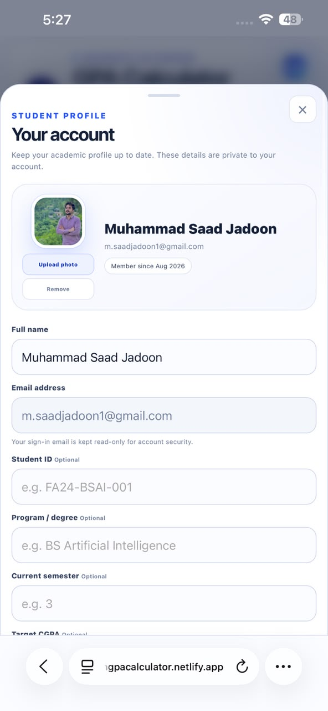
  &nbsp;&nbsp;
  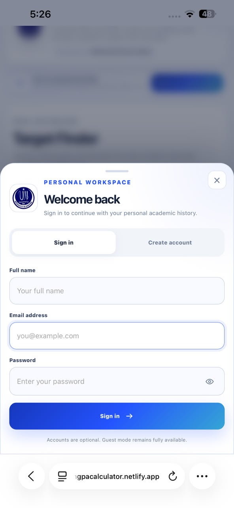
</p>

<p align="center">
  <strong>Student Profile</strong>
  &nbsp;&nbsp;&nbsp;&nbsp;&nbsp;&nbsp;&nbsp;&nbsp;&nbsp;&nbsp;&nbsp;&nbsp;
  <strong>Sign In</strong>
</p>

<p align="center">
  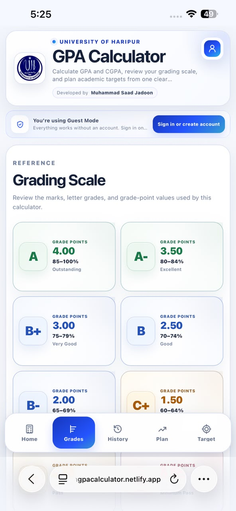
  &nbsp;&nbsp;
  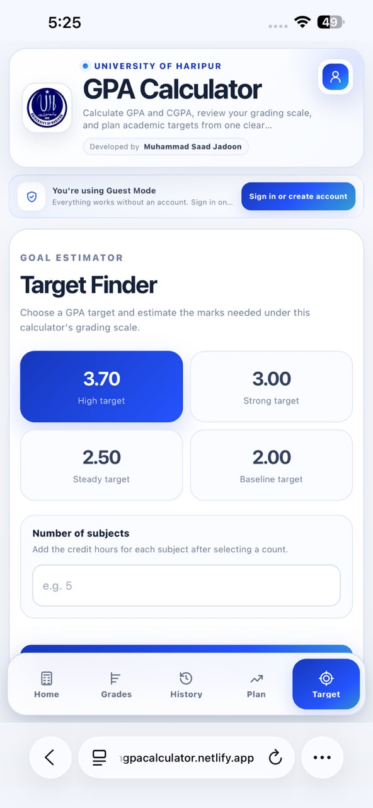
</p>

<p align="center">
  <strong>Grading Scale</strong>
  &nbsp;&nbsp;&nbsp;&nbsp;&nbsp;&nbsp;&nbsp;&nbsp;&nbsp;&nbsp;&nbsp;&nbsp;
  <strong>Target Finder</strong>
</p>

---

## Notes

- The calculator should be used as an academic planning utility.
- Students should confirm official results through the university's official academic records.
- Grading policies may differ by department, course, or academic session.
- The project does not claim to replace an official university result system.

---

## Author

**Muhammad Saad Jadoon**  
BS Artificial Intelligence — 3rd Semester  
University of Haripur

---

## Project Links

**Live Application**  
https://uoh-gpa-calculator-dt4u.onrender.com/

**Repository**  
Add the GitHub repository URL here after publishing the project.
